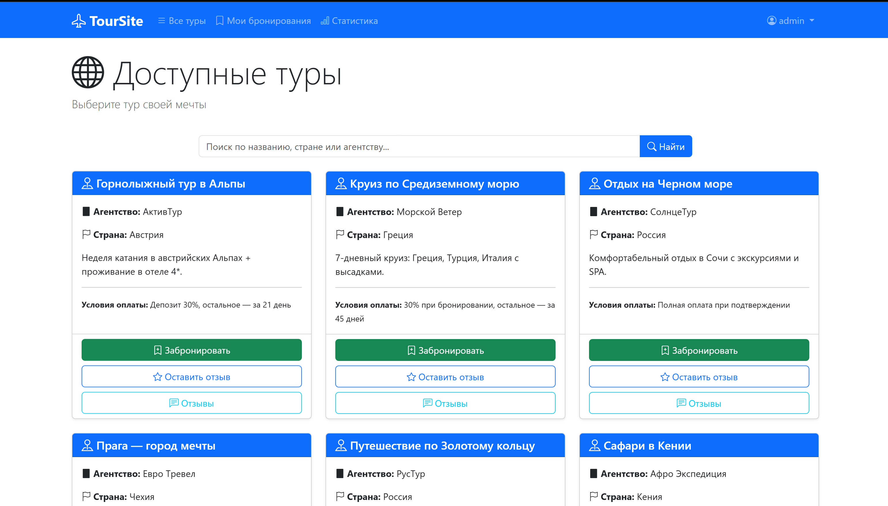
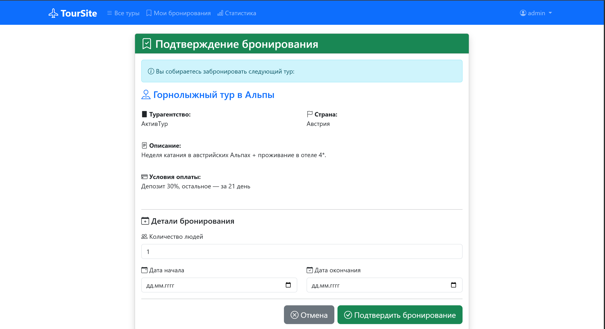
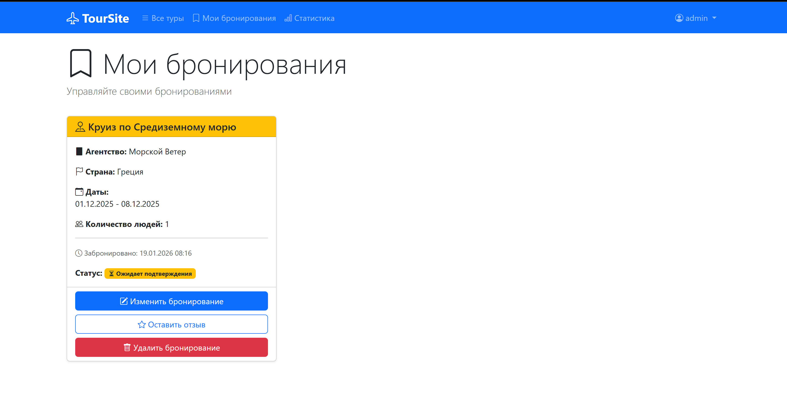
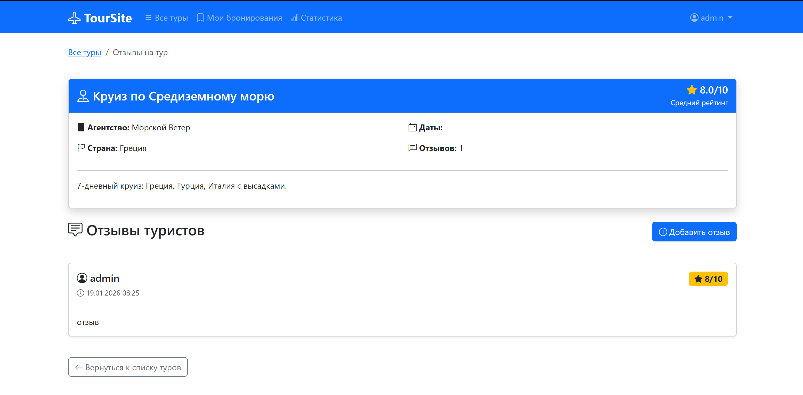
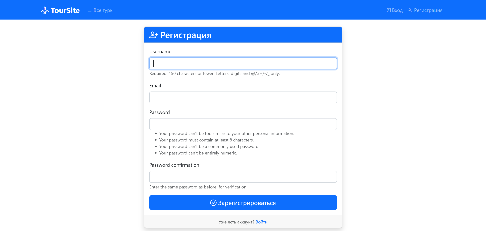
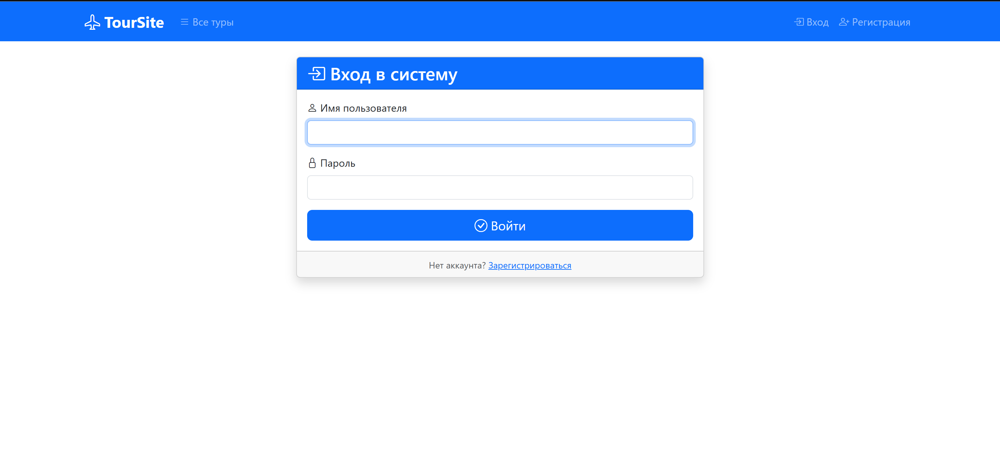
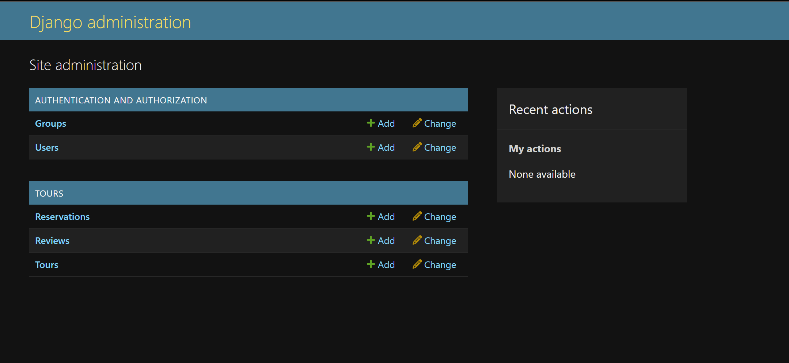

# Введение

В данной лабораторной работе было создано веб приложение на основе django для управления турами от различных турагенств, а также их бронированиями и отзывами о турах. Было добавлена навигационное меню с использованием bootstrap, пагинация и поиск туров по странам, названиям и тур оператору. Так же всё приложение было собрано в docker и запускается посредством docker-compose вместе с базой данных, необходимой для работы.

# Запуск
Для запуска нужно:

1. Собрать docker image: ```docker build -t tour-site:latest .```
2. Запустить compose: ```docker compose up -d```
# Интерфейсы
## Список туров

## Подтверждение бронирования

## Бронирования

## Отзывы

## Добавление отзыва

## Регистрация

## Вход

## Админская панель

# Реализация
## Модели

```python
from django.db import models

from django.db import models
from django.contrib.auth.models import User

class Tour(models.Model):
    name = models.CharField(max_length=200, verbose_name="Название тура")
    agency = models.CharField(max_length=200, verbose_name="Турагентство")
    description = models.TextField(verbose_name="Описание")
    payment_terms = models.TextField(verbose_name="Условия оплаты")
    country = models.CharField(max_length=100, verbose_name="Страна")

    def __str__(self):
        return self.name

class Reservation(models.Model):
    user = models.ForeignKey(User, on_delete=models.CASCADE)
    tour = models.ForeignKey(Tour, on_delete=models.CASCADE)
    reservation_date = models.DateTimeField(auto_now_add=True)
    reservation_approve = models.BooleanField(default=False, verbose_name="Подтверждение бронирования")
    n_people = models.IntegerField(default=1, verbose_name="Кол-во людей в бронировании")
    start_date = models.DateField(verbose_name="Дата начала")
    end_date = models.DateField(verbose_name="Дата окончания")

    def __str__(self):
        return f"{self.user.username} - {self.tour.name}"

class Review(models.Model):
    tour = models.ForeignKey(Tour, on_delete=models.CASCADE)
    user = models.ForeignKey(User, on_delete=models.CASCADE)
    comment = models.TextField(verbose_name="Текст отзыва")
    rating = models.IntegerField(choices=[(i, i) for i in range(1, 11)], verbose_name="Рейтинг (1-10)")
    created_at = models.DateTimeField(auto_now_add=True)

    def __str__(self):
        return f"Отзыв от {self.user.username} на {self.tour.name}"
```
## Представления
``` python
from django.shortcuts import render, redirect, get_object_or_404
from django.contrib.auth.decorators import login_required
from django.contrib import messages
from django.views.generic import ListView
from django.db.models import Q, Count, Avg
from .models import Tour, Reservation, Review
from .forms import UserRegisterForm, ReviewForm, ReserveForm

TEMPLATES_DIR = 'tours/'

def register(request):
    if request.method == 'POST':
        form = UserRegisterForm(request.POST)
        if form.is_valid():
            form.save()
            username = form.cleaned_data.get('username')
            messages.success(request, f'Аккаунт {username} создан')
            return redirect('login')
    else:
        form = UserRegisterForm()
    return render(request, f'{TEMPLATES_DIR}register.html', {'form': form})

class TourListView(ListView):
    model = Tour
    template_name = 'tours/tour_list.html'
    context_object_name = 'tours'
    paginate_by = 6
    
    def get_queryset(self):
        queryset = Tour.objects.all().annotate(
            average_rating=Avg('review__rating')
        )
        search_query = self.request.GET.get('search', '')
        
        if search_query:
            queryset = queryset.filter(
                Q(name__icontains=search_query) |
                Q(country__icontains=search_query) |
                Q(agency__icontains=search_query)
            )
        
        return queryset.order_by('name')
    
    def get_context_data(self, **kwargs):
        context = super().get_context_data(**kwargs)
        context['search_query'] = self.request.GET.get('search', '')
        return context

@login_required
def reserve_tour(request, tour_id):
    tour = get_object_or_404(Tour, id=tour_id)
    if request.method == 'POST':
        form = ReserveForm(request.POST)
        if form.is_valid():
            reserve = form.save(commit=False)
            reserve.tour = tour
            reserve.user = request.user
            reserve.save()
            messages.success(request, 'Тур забронирован')
            return redirect('my_reservations')
    else:
        form = ReserveForm()
    return render(request, f'{TEMPLATES_DIR}reserve_confirm.html', {'tour': tour, 'form': form})

@login_required
def change_tour(request, tour_id, reservation_id):
    tour = get_object_or_404(Tour, id=tour_id)
    reservation = get_object_or_404(Reservation, id=reservation_id)
    if request.method == 'POST':
        form = ReserveForm(request.POST, instance=reservation)
        if form.is_valid():
            reservation = form.save(commit=False)
            reservation.reservation_approve = False
            reservation.save()
            messages.success(request, 'Тур Изменен')
            return redirect('my_reservations')
    else:
        form = ReserveForm(instance=reservation)
    return render(request, f'{TEMPLATES_DIR}reserve_confirm.html', {'tour': tour, 'form': form})

@login_required
def my_reservations(request):
    reservations = Reservation.objects.filter(user=request.user)
    return render(request, f'{TEMPLATES_DIR}my_reservations.html', {'reservations': reservations})

@login_required
def delete_reservation(request, reservation_id):
    reservation = get_object_or_404(Reservation, id=reservation_id, user=request.user)
    reservation.delete()
    messages.success(request, 'Бронирование удалено.')
    return redirect('my_reservations')

@login_required
def add_review(request, tour_id):
    tour = get_object_or_404(Tour, id=tour_id)
    if request.method == 'POST':
        form = ReviewForm(request.POST)
        if form.is_valid():
            review = form.save(commit=False)
            review.tour = tour
            review.user = request.user
            review.save()
            messages.success(request, 'Отзыв добавлен')
            return redirect('tour_list')
    else:
        form = ReviewForm()
    return render(request, f'{TEMPLATES_DIR}add_review.html', {'tour': tour, 'form': form})

def sold_tours_by_country(request):
    data = Tour.objects.filter(reservation__isnull=False).values('country').annotate(count=Count('id')).order_by('-count')
    total_count = sum(item['count'] for item in data)
    return render(request, f'{TEMPLATES_DIR}sold_tours.html', {'data': data, 'total_count': total_count})

def tour_reviews(request, tour_id):
    tour = get_object_or_404(Tour, id=tour_id)
    reviews = Review.objects.filter(tour=tour).order_by('-created_at')
    
    if reviews.exists():
        from django.db.models import Avg
        avg_rating = reviews.aggregate(Avg('rating'))['rating__avg']
        tour.average_rating = avg_rating
    else:
        tour.average_rating = None
    
    return render(request, 'tours/tour_reviews.html', {'tour': tour, 'reviews': reviews})
```

## Формы
``` python
from django import forms
from django.contrib.auth.models import User
from django.contrib.auth.forms import UserCreationForm
from .models import Review, Reservation

class UserRegisterForm(UserCreationForm):
    email = forms.EmailField()

    class Meta:
        model = User
        fields = ['username', 'email', 'password1', 'password2']

class ReviewForm(forms.ModelForm):
    class Meta:
        model = Review
        fields = ['rating', 'comment']
        widgets = {
            'rating': forms.Select(attrs={'class': 'form-select'}),
            'comment': forms.Textarea(attrs={
                'class': 'form-control',
                'rows': 6,
                'placeholder': 'Расскажите о своих впечатлениях от тура...'
            })
        }
        labels = {
            'rating': 'Рейтинг (1-10)',
            'comment': 'Ваш отзыв'
        }

class ReserveForm(forms.ModelForm):
    class Meta:
        model = Reservation
        fields = ['n_people', 'start_date', 'end_date']
        widgets = {
            'n_people': forms.NumberInput(attrs={
                'class': 'form-control',
                'min': 1,
                'placeholder': 'Введите количество человек'
            }),
            'start_date': forms.DateInput(attrs={
                'type': 'date',
                'class': 'form-control'
            }),
            'end_date': forms.DateInput(attrs={
                'type': 'date',
                'class': 'form-control'
            })
        }
        labels = {
            'n_people': 'Количество людей',
            'start_date': 'Дата начала',
            'end_date': 'Дата окончания'
        }
    
    def clean(self):
        cleaned_data = super().clean()
        start_date = cleaned_data.get('start_date')
        end_date = cleaned_data.get('end_date')
        n_people = cleaned_data.get('n_people')
        
        if start_date and end_date:
            if start_date >= end_date:
                raise forms.ValidationError('Дата окончания должна быть позже даты начала')
        
        if n_people and n_people < 1:
            raise forms.ValidationError('Количество людей должно быть не менее 1')
        
        return cleaned_data
```