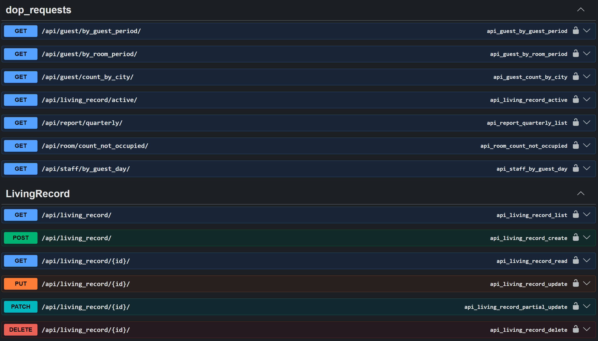
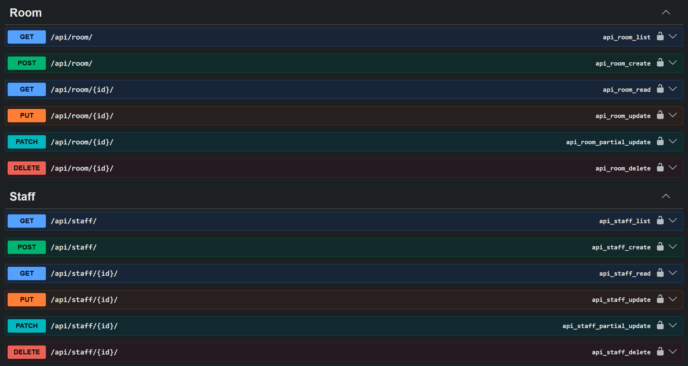
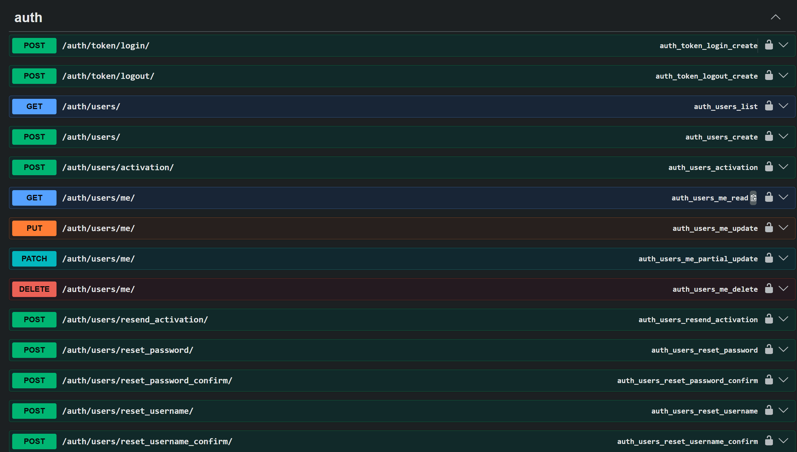
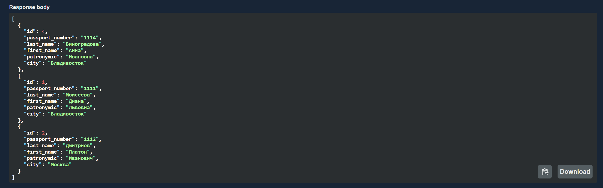
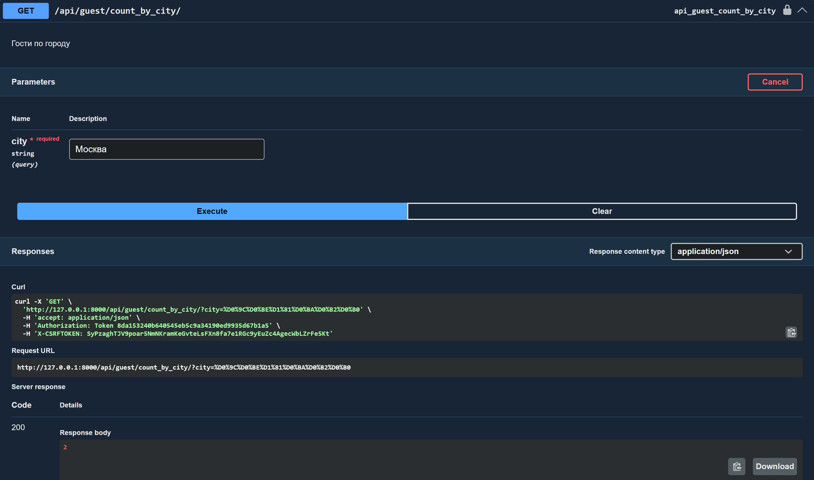
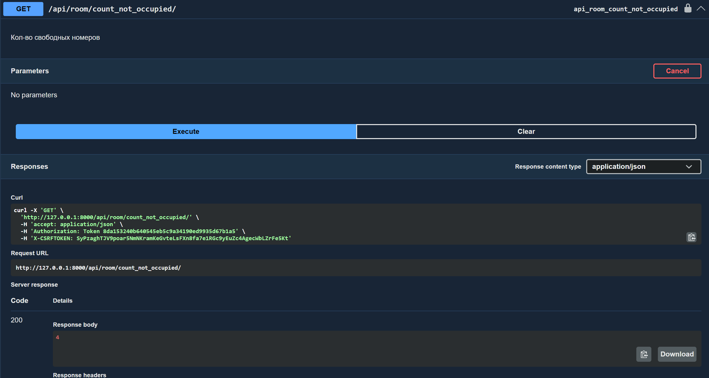
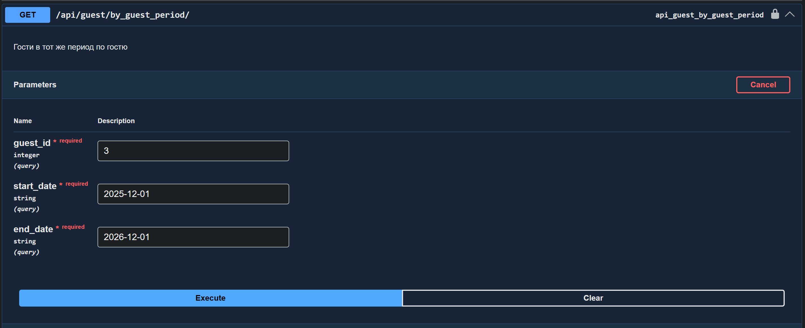
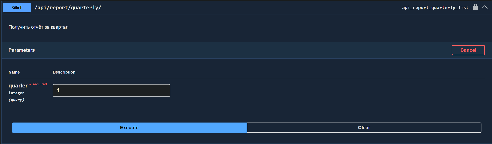

# Задание
Реализовать модель базы данных средствами DjangoORM (согласовать с преподавателем на консультации). 1. Реализовать логику работу API средствами Django REST Framework (используя методы сериализации).

1. Реализовать модель базы данных средствами DjangoORM
2. Реализовать логику работу API средствами Django REST Framework
3. Подключить регистрацию / авторизацию по токенам / вывод информации о текущем пользователе средствами Djoser.

# Вариант
Создать программную систему, предназначенную для администратора гостиницы.
Такая система должна обеспечивать хранение сведений об имеющихся в гостинице
номерах, о проживающих в гостинице клиентах и о служащих, убирающихся в номерах.
Количество номеров в гостинице известно, и имеются номера трех типов: одноместный,
двухместный и трехместный, отличающиеся стоимостью проживания в сутки. В каждом
номере есть телефон.
О каждом проживающем должна храниться следующая информация: номер
паспорта, фамилия, имя, отчество, город, из которого он прибыл, дата поселения в
гостинице, выделенный гостиничный номер.
О служащих гостиницы должна быть известна информация следующего содержания:
фамилия, имя, отчество, где (этаж) и когда (день недели) он убирает. Служащий
гостиницы убирает все номера на одном этаже в определенные дни недели, при этом в
разные дни он может убирать разные этажи.

Работа с системой предполагает получение следующей информации:

1. о клиентах, проживавших в заданном номере, в заданный период времени;
2. о количестве клиентов, прибывших из заданного города,
3. о том, кто из служащих убирал номер указанного клиента в заданный день недели,
4. сколько в гостинице свободных номеров;
5. список клиентов с указанием места жительства, которые проживали в те же дни, что и заданный клиент, в определенный период времени.

Администратор должен иметь возможность выполнить следующие операции:

1. принять на работу или уволить служащего гостиницы;
2. изменить расписание работы служащего;
3. поселить или выселить клиента.

Необходимо предусмотреть также возможность автоматической выдачи отчета о
работе гостиницы за указанный квартал текущего года. Такой отчет должен содержать
следующие сведения:

1. число клиентов за указанный период в каждом номере;
2. количество номеров не каждом этаже;
3. общая сумма дохода за каждый номер;
4. суммарный доход по всей гостинице.
# Выполнение
## 1
При помощи DjangoORM была реализована модель базы данных:
``` python
from django.db import models


class Floor(models.Model):
    number = models.PositiveIntegerField(unique=True, verbose_name="Номер этажа")
    description = models.TextField(null=True, blank=True, verbose_name="Описание этажа")

class Room(models.Model):
    room_types = (
        ('single', 'Одноместный'),
        ('double', 'Двухместный'),
        ('triple', 'Трехместный'),
    )
    number = models.CharField(max_length=10, unique=True, verbose_name="Номер комнаты")
    room_type = models.CharField(max_length=10, choices=room_types, verbose_name="Тип номера")
    price = models.DecimalField(max_digits=10, decimal_places=2, verbose_name="Стоимость за день")
    phone = models.CharField(max_length=20, verbose_name="Телефон в номере")    
    floor = models.ForeignKey(Floor, on_delete=models.CASCADE, related_name="rooms", verbose_name="Этаж")

    def __str__(self):
        return f"Номер {self.number} ({self.get_room_type_display()})"


class Guest(models.Model):
    passport_number = models.CharField(max_length=20, unique=True, verbose_name="Номер паспорта")
    last_name = models.CharField(max_length=100, verbose_name="Фамилия")
    first_name = models.CharField(max_length=100, verbose_name="Имя")
    patronymic = models.CharField(max_length=100, blank=True, verbose_name="Отчество")
    city = models.CharField(max_length=100, verbose_name="Город")

    def __str__(self):
        return f"{self.last_name} {self.first_name} ({self.passport_number})"

class LivingRecord(models.Model):
    guest = models.ForeignKey(Guest, on_delete=models.CASCADE, related_name="living_records", verbose_name="Гость")
    room = models.ForeignKey(Room, on_delete=models.CASCADE, related_name="living_records", verbose_name="Номер")
    start_date = models.DateField(verbose_name="Дата заезда")
    end_date = models.DateField(null=True, blank=True, verbose_name="Дата выезда")

    def __str__(self):
        return f"{self.guest} {self.room}"

class Staff(models.Model):
    last_name = models.CharField(max_length=100, verbose_name="Фамилия")
    first_name = models.CharField(max_length=100, verbose_name="Имя")
    patronymic = models.CharField(max_length=100, blank=True, verbose_name="Отчество")

    def __str__(self):
        return f"{self.last_name} {self.first_name}"


class CleaningSchedule(models.Model):
    days_of_week = (
        (1, 'Понедельник'),
        (2, 'Вторник'),
        (3, 'Среда'),
        (4, 'Четверг'),
        (5, 'Пятница'),
        (6, 'Суббота'),
        (7, 'Воскресенье'),
    )   
    staff = models.ForeignKey(Staff, on_delete=models.CASCADE, related_name="cleaning_schedules", verbose_name="Служащий")
    floor = models.ForeignKey(Floor, on_delete=models.CASCADE, related_name="cleaning_schedules", verbose_name="Этаж")
    day_of_week = models.PositiveSmallIntegerField(choices=days_of_week, verbose_name="День недели")

    class Meta:
        unique_together = ('floor', 'day_of_week')

    def __str__(self):
        return f"{self.staff} — этаж {self.floor}, {self.get_day_of_week_display()}"

class CleaningRecord(models.Model):
    staff = models.ForeignKey(Staff, on_delete=models.CASCADE, related_name="cleaning_records", verbose_name="Служащий")
    floor = models.ForeignKey(Floor, on_delete=models.CASCADE, related_name="cleaning_records", verbose_name="Этаж")
    cleaning_date = models.DateField(verbose_name="Дата уборки")

    class Meta:
        unique_together = ('floor', 'cleaning_date')

    def __str__(self):
        return f"{self.staff} — этаж {self.floor}, {self.cleaning_date}"
```

## 2
При помощи Django REST Framework были созданы основные эндпоинты при помощи ViewSet а так же дополнительные требуемые запросы. Использовалась библиотека drf-yasg для красивого оформления сваггера апи. 





## 3
Как видно по фото выше так же была подключена авторизация по токенам при помощи Djoser
## Выполнение доп запросов из варианта










# Листинги
## Сериалиазторы
```python
from rest_framework import serializers
from .models import Floor, Room, Guest, LivingRecord, Staff, CleaningSchedule, CleaningRecord


class FloorSerializer(serializers.ModelSerializer):
    class Meta:
        model = Floor
        fields = '__all__'

class RoomSerializer(serializers.ModelSerializer):
    class Meta:
        model = Room
        fields = '__all__'


class GuestSerializer(serializers.ModelSerializer):
    class Meta:
        model = Guest
        fields = '__all__'


class LivingRecordSerializer(serializers.ModelSerializer):
    guest = GuestSerializer(read_only=True)
    room = RoomSerializer(read_only=True)

    class Meta:
        model = LivingRecord
        fields = '__all__'

class LivingRecordSimpleSerializer(serializers.ModelSerializer):
    class Meta:
        model = LivingRecord
        fields = '__all__'


class StaffSerializer(serializers.ModelSerializer):
    class Meta:
        model = Staff
        fields = '__all__'


class CleaningScheduleSerializer(serializers.ModelSerializer):
    staff = StaffSerializer(read_only=True)
    floor = FloorSerializer(read_only=True)

    class Meta:
        model = CleaningSchedule
        fields = '__all__'

class CleaningScheduleSimpleSerializer(serializers.ModelSerializer):
    class Meta:
        model = CleaningSchedule
        fields = '__all__'

class FloorFullSerializer(serializers.ModelSerializer):
    rooms = RoomSerializer(many=True, read_only=True)
    cleaning_schedules = CleaningScheduleSimpleSerializer(many=True, read_only=True)

    class Meta:
        model = Floor
        fields = '__all__'

class StaffFullSerializer(serializers.ModelSerializer):
    cleaning_schedules = CleaningScheduleSerializer(many=True, read_only=True)

    class Meta:
        model = Staff
        fields = '__all__'

class GuestFullSerializer(serializers.ModelSerializer):
    living_records = LivingRecordSerializer(many=True, read_only=True)

    class Meta:
        model = Guest
        fields = '__all__'

class RoomFullSerializer(serializers.ModelSerializer):
    living_records = LivingRecordSerializer(many=True, read_only=True)
    floor = FloorFullSerializer(read_only=True)
    
    class Meta:
        model = Room
        fields = '__all__'

class CleaningRecordSerializer(serializers.ModelSerializer):
    floor = FloorSerializer(read_only=True)
    staff = StaffSerializer(read_only=True)

    class Meta:
        model = CleaningRecord
        fields = '__all__'

class CleaningRecordSimpleSerializer(serializers.ModelSerializer):
    class Meta:
        model = CleaningRecord
        fields = '__all__'
```
## Представления
```python
from rest_framework import viewsets, status
from rest_framework.decorators import action, api_view
from rest_framework.response import Response
from .models import Floor, Room, Guest, LivingRecord, Staff, CleaningSchedule, CleaningRecord
from .serializers import (FloorSerializer, RoomSerializer, GuestSerializer, LivingRecordSerializer, 
                          StaffSerializer, CleaningScheduleSerializer, FloorFullSerializer, RoomFullSerializer,
                          GuestFullSerializer, StaffFullSerializer, CleaningScheduleSimpleSerializer, 
                          LivingRecordSimpleSerializer, CleaningRecordSerializer, CleaningRecordSimpleSerializer)
from drf_yasg.utils import swagger_auto_schema
from drf_yasg import openapi
from datetime import date
from django.db.models import Count, Q
from django.utils.decorators import method_decorator

def tagged_viewset(tag_name):
    def wrapper(cls):
        actions = ['list', 'create', 'retrieve', 'update', 'partial_update', 'destroy']
        for action in actions:
            if hasattr(cls, action):
                decorator = swagger_auto_schema(tags=[tag_name])
                setattr(cls, action, method_decorator(decorator, name=action)(getattr(cls, action)))
        return cls
    return wrapper

@tagged_viewset('Floor')
class FloorViewSet(viewsets.ModelViewSet):
    queryset = Floor.objects.all()
    serializer_class = FloorSerializer

    def get_serializer_class(self):
        if self.action == 'retrieve':
            return FloorFullSerializer
        return FloorSerializer

@tagged_viewset('Room')
class RoomViewSet(viewsets.ModelViewSet):
    queryset = Room.objects.all()
    serializer_class = RoomSerializer

    def get_serializer_class(self):
        if self.action == 'retrieve':
            return RoomFullSerializer
        return RoomSerializer
    
    @swagger_auto_schema(
        operation_description="Кол-во свободных номеров",
        responses={200: openapi.Response(
            description="Кол-во свободных номеров",
            schema=openapi.Schema(type=openapi.TYPE_INTEGER)
        )},
        tags=['dop_requests']
    )
    @action(detail=False, methods=['get'])
    def count_not_occupied(self, request):
        today = date.today()
        n_free_rooms = Room.objects.exclude(
            Q(living_records__end_date__gte=today) | Q(living_records__end_date__isnull=True),
            living_records__start_date__lte=today).count()
        return Response(n_free_rooms)

@tagged_viewset('Guest')
class GuestViewSet(viewsets.ModelViewSet):
    queryset = Guest.objects.all()
    serializer_class = GuestSerializer

    def get_serializer_class(self):
        if self.action == 'retrieve':
            return GuestFullSerializer
        return GuestSerializer
    
    @swagger_auto_schema(
        operation_description="Гости по городу",
        manual_parameters=[
            openapi.Parameter('city', openapi.IN_QUERY, type=openapi.TYPE_STRING, required=True)
        ],
        responses={200: openapi.Response(
            description="Кол-во гостей из города",
            schema=openapi.Schema(type=openapi.TYPE_INTEGER)
        )},
        tags=['dop_requests']
    )
    @action(detail=False, methods=['get'])
    def count_by_city(self, request):
        city = request.query_params.get('city')
        if not city:
            return Response({"error": "Укажите параметр city"}, status=status.HTTP_400_BAD_REQUEST)
        n_guests = Guest.objects.filter(city=city).count()
        return Response(n_guests)
    
    @swagger_auto_schema(
        operation_description="Гости за период по номеру",
        manual_parameters=[
            openapi.Parameter('room_id', openapi.IN_QUERY, type=openapi.TYPE_INTEGER, required=True),
            openapi.Parameter('start_date', openapi.IN_QUERY, type=openapi.TYPE_STRING, required=True),
            openapi.Parameter('end_date', openapi.IN_QUERY, type=openapi.TYPE_STRING, required=True)
        ],
        responses={200: GuestSerializer(many=True)},
        tags=['dop_requests']
    )
    @action(detail=False, methods=['get'])
    def by_room_period(self, request):
        room_id = request.query_params.get('room_id')
        start = request.query_params.get('start_date')
        end = request.query_params.get('end_date')
        records = LivingRecord.objects.filter(
            Q(end_date__gte=start) | Q(end_date__isnull=True),
            room_id=room_id,
            start_date__lte=end,
        ).select_related('guest')

        guests = [record.guest for record in records]
        return Response(GuestSerializer(guests, many=True).data)
    
    @swagger_auto_schema(
        operation_description="Гости в тот же период по гостю",
        manual_parameters=[
            openapi.Parameter('guest_id', openapi.IN_QUERY, type=openapi.TYPE_INTEGER, required=True),
            openapi.Parameter('start_date', openapi.IN_QUERY, type=openapi.TYPE_STRING, required=True),
            openapi.Parameter('end_date', openapi.IN_QUERY, type=openapi.TYPE_STRING, required=True)
        ],
        responses={200: GuestSerializer(many=True)},
        tags=['dop_requests']
    )
    @action(detail=False, methods=['get'])
    def by_guest_period(self, request):
        guest_id = request.query_params.get('guest_id')
        start = request.query_params.get('start_date')
        end = request.query_params.get('end_date')
        guest_record = LivingRecord.objects.filter(
            guest_id=guest_id,
            start_date__gte=start,
            end_date__lte=end
            ).first()
        
        start = max(str(guest_record.start_date), start)
        end = min(str(guest_record.end_date) or end, end)
        guests = Guest.objects.filter(
            living_records__start_date__lte=end,
            living_records__end_date__gte=start
        ).exclude(pk=guest_id).distinct()

        return Response(GuestSerializer(guests, many=True).data)

@tagged_viewset('LivingRecord')
class LivingRecordViewSet(viewsets.ModelViewSet):
    queryset = LivingRecord.objects.all()
    serializer_class = LivingRecordSerializer

    def get_serializer_class(self):
        if self.action in ['create', 'update', 'partial_update']:
            return LivingRecordSimpleSerializer
        return LivingRecordSerializer
    
    @swagger_auto_schema(
        operation_description="Проживания сейчас",
        responses={200: LivingRecordSerializer},
        tags=['dop_requests']
    )
    @action(detail=False, methods=['get'])
    def active(self, request):
        today_date = date.today()
        active_living_records = LivingRecord.objects.filter(
            Q(end_date__gte=today_date) | Q(end_date__isnull=True),
            start_date__lte=today_date
        )
        return Response(LivingRecordSerializer(active_living_records, many=True).data)

@tagged_viewset('Staff')
class StaffViewSet(viewsets.ModelViewSet):
    queryset= Staff.objects.all()
    serializer_class = StaffSerializer

    def get_serializer_class(self):
        if self.action == 'retrieve':
            return StaffFullSerializer
        return StaffSerializer
    
    @swagger_auto_schema(
        operation_description="Сотрудник, который убирал номер клиента в заданый день",
        manual_parameters=[
            openapi.Parameter('guest_id', openapi.IN_QUERY, type=openapi.TYPE_INTEGER, required=True),
            openapi.Parameter('date', openapi.IN_QUERY, type=openapi.TYPE_STRING, required=True)
        ],
        responses={200: StaffSerializer(many=True)},
        tags=['dop_requests']
    )
    @action(detail=False, methods=['get'])
    def by_guest_day(self, request):
        guest_id = request.query_params.get('guest_id')
        cleaning_date = request.query_params.get('date')
        if not guest_id or not date:
            return Response({"error": "не указаны нужные параметры"}, status=status.HTTP_400_BAD_REQUEST)
        try:
            living_record = LivingRecord.objects.filter(
                Q(end_date__gte=cleaning_date) | Q(end_date__isnull=True),
                guest_id=guest_id,
                start_date__lte=cleaning_date,
                ).first()
            if not living_record:
                return Response({"error": "Данный гость не проживал в данную дату"}, status=status.HTTP_400_BAD_REQUEST)
            floor = living_record.room.floor
            staff = CleaningRecord.objects.get(floor=floor, cleaning_date=cleaning_date).staff
            return Response(StaffSerializer(staff).data)
        except:
            return Response({"error": "Ошибка при обработке"}, status=status.HTTP_500_INTERNAL_SERVER_ERROR)

@tagged_viewset('CleaningSchedule')
class CleaningScheduleViewSet(viewsets.ModelViewSet):
    queryset = CleaningSchedule.objects.all()
    serializer_class = CleaningScheduleSerializer

    def get_serializer_class(self):
        if self.action in ['create', 'update', 'partial_update']:
            return CleaningScheduleSimpleSerializer
        return CleaningScheduleSerializer

@tagged_viewset('CleaningRecord')
class CleaningRecordViewSet(viewsets.ModelViewSet):
    queryset = CleaningRecord.objects.all()
    serializer_class = CleaningRecordSerializer

    def get_serializer_class(self):
        print(self.queryset)
        if self.action in ['create', 'update', 'partial_update']:
            return CleaningRecordSimpleSerializer
        return CleaningRecordSerializer

@swagger_auto_schema(
    method='get',
    operation_description="Получить отчёт за квартал",
    manual_parameters=[
        openapi.Parameter('quarter', openapi.IN_QUERY, type=openapi.TYPE_INTEGER, required=True)
    ],
    responses={200: "Отчёт за квартал"},
    tags=['dop_requests']
)
@api_view(['GET'])
def hotel_quarterly_report(request):
    quarter = request.query_params.get('quarter')
    year_now = date.today().year
    quarters = {
        1: (date(year_now, 1, 1), date(year_now, 3, 31)),
        2: (date(year_now, 4, 1), date(year_now, 6, 30)),
        3: (date(year_now, 7, 1), date(year_now, 9, 30)),
        4: (date(year_now, 10, 1), date(year_now, 12, 31)),
    }
    start_date, end_date = quarters[int(quarter)]
    rooms = Room.objects.all()
    room_report = []
    income = 0
    for room in rooms:
        living_records = LivingRecord.objects.filter(
                room=room,
                start_date__lte=end_date,
                end_date__gte=start_date
            )
        guest_count = living_records.count()
        income_room = 0
        for record in living_records:
            start = max(start_date, record.start_date)
            end = min(end_date, record.end_date or date.today())
            if end < start:
                continue
            income_room += float(room.price) * (end - start).days + 1
        room_report.append({
            'room_id': room.id,
            'guests': guest_count,
            'income': str(round(income_room, 2))
        })
        income += income_room
    floor_count = Floor.objects.annotate(room_count=Count('rooms'))
    floor_report = {floor.id: floor.room_count for floor in floor_count}
    return Response({
        "income":  str(round(income, 2)),
        "room_report": room_report,
        "floor_report": floor_report
    })
```