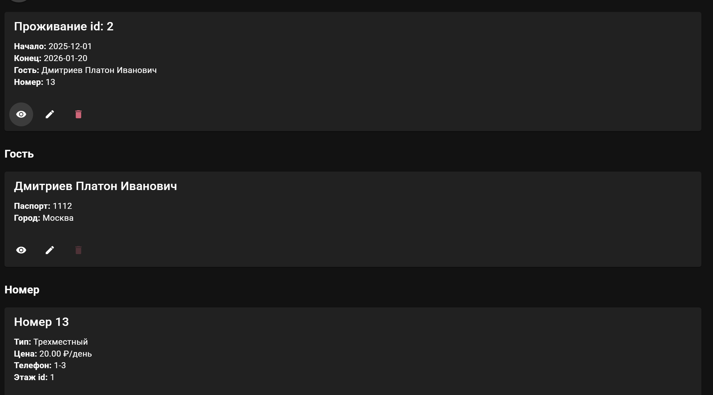
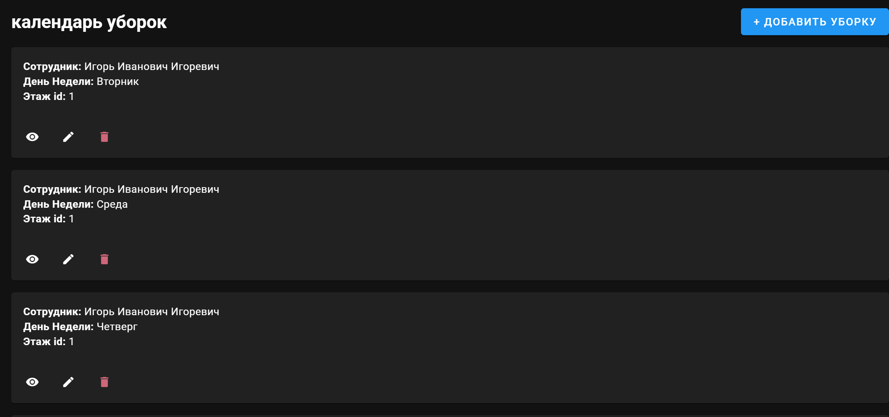
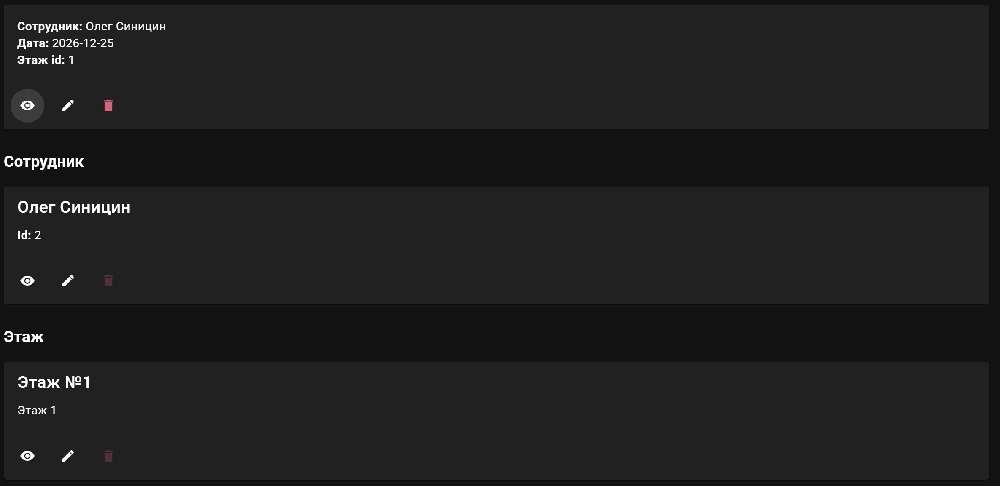
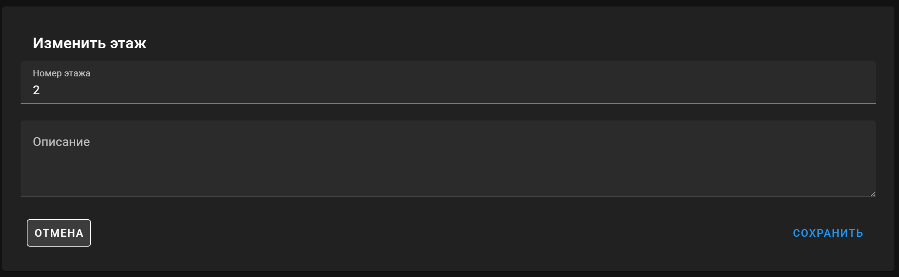
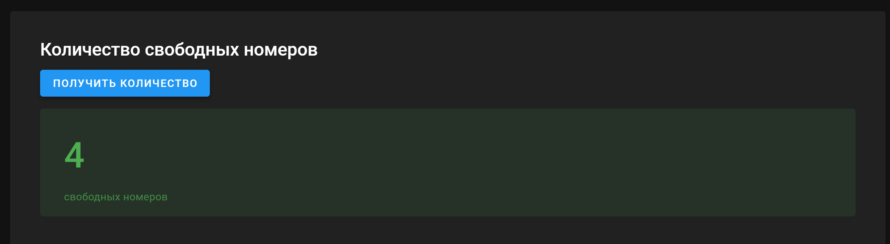
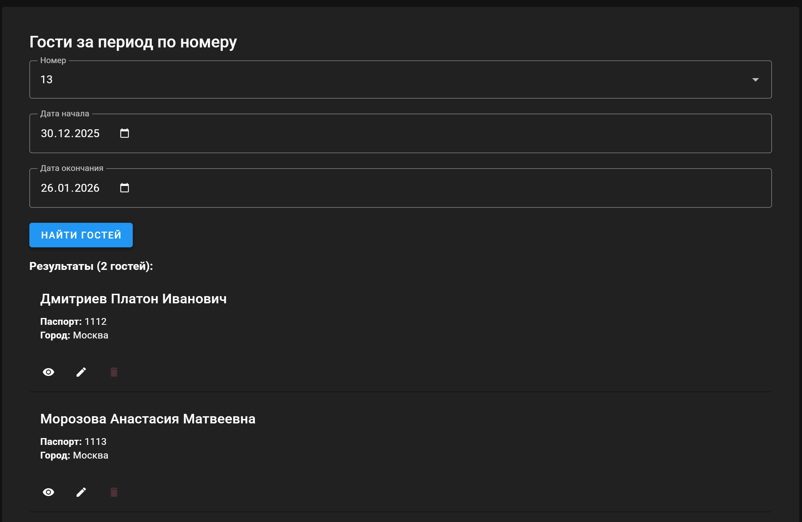
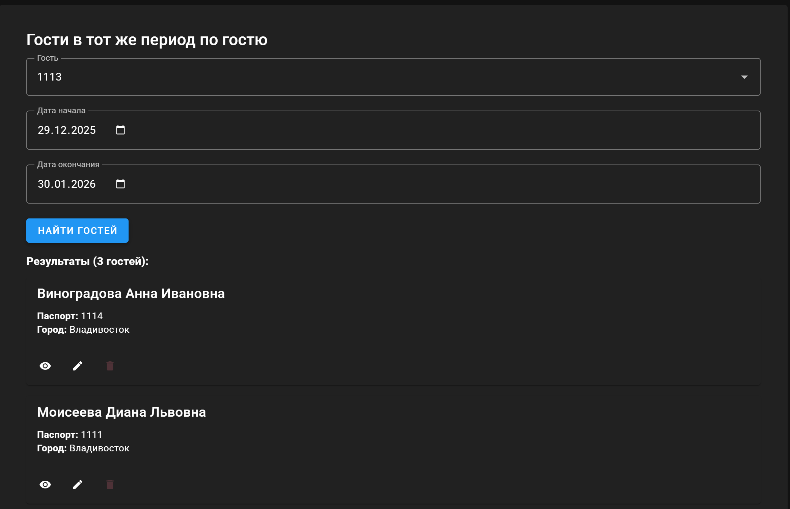
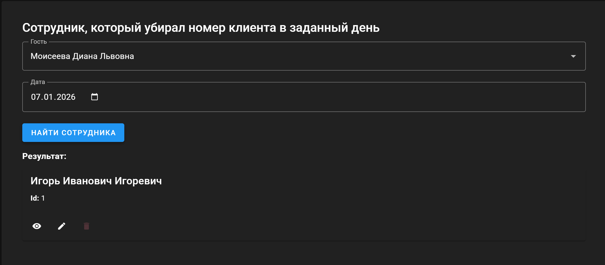
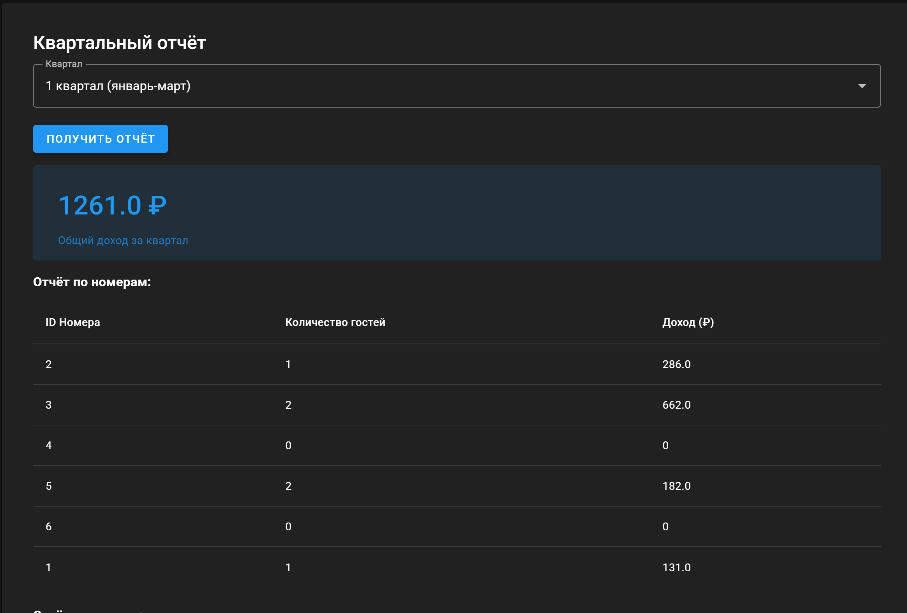

# Задание
1. Настроить для серверной части, реализованной в лабораторной работе №3 CORS (Cross-origin resource sharing)
2. Реализовать интерфейсы авторизации, регистрации и изменения учётных данных и настроить взаимодействие с серверной частью.
3. Реализовать клиентские интерфейсы и настроить взаимодействие с серверной частью
4. Подключить vuetify или аналогичную библиотеку.
# Выполнение
# 1
Подключение cors делается при помощи библиотеки django-cors-headers
В settings.py нужно добавить приложение данной библиотеки и настроить доступ для приложения на vue при помощи CORS_ALLOWED_ORIGINS
# 2

# 3
Для отоброжения клиенстких интерфесов, была создана карточка под каждую сущность в компонентах и она использовалась для отображения как основных так и связанных сущностей везде, где нужно было. Для сущностей была сделана возможность, создать, изменить, удалить, а так же просмотреть список всех объектов данной сущности и 1 конкретный с более детальной информацией.
## Гости

## Записи о проживании

## Сотрудники

## Комнаты

# Расписание уборкок

## Записи об уборках 

## Этажи

## Доп запросы

