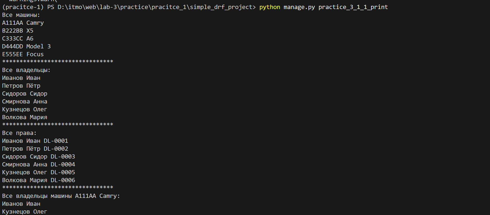
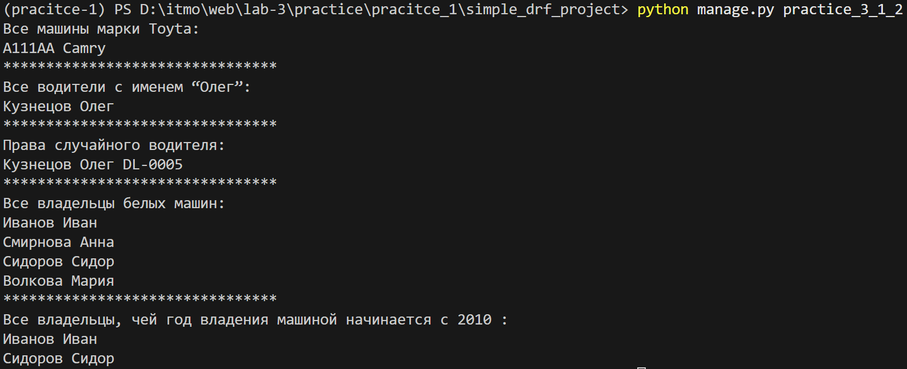
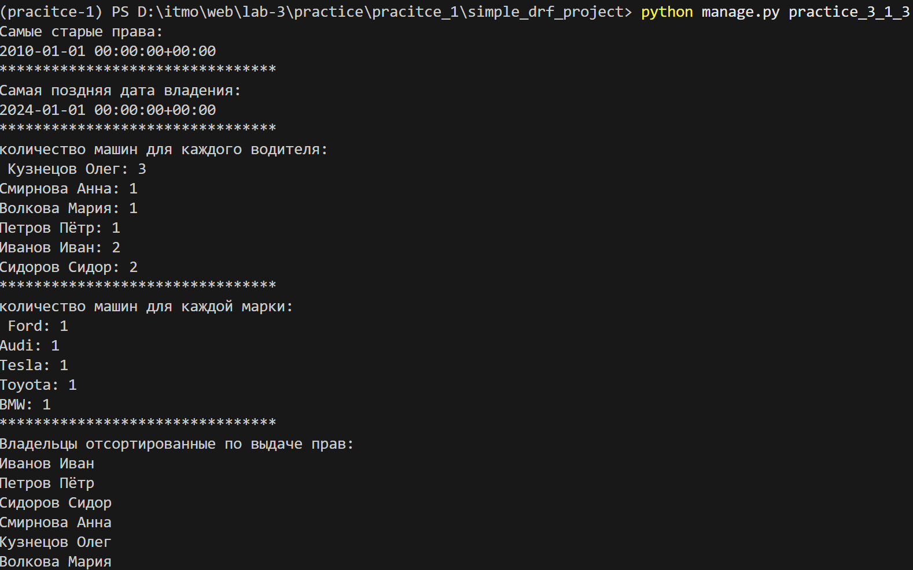

# Практическое задание 1
## Задание
Напишите запрос на создание 6-7 новых автовладельцев и 5-6 автомобилей, каждому автовладельцу назначьте удостоверение и от 1 до 3 автомобилей. Задание можете выполнить либо в интерактивном режиме интерпретатора, либо в отдельном python-файле. Результатом должны стать запросы и отображение созданных объектов. 
Если вы добавляете автомобили владельцу через метод .add(), не забудьте заполнить также ассоциативную сущность “владение”
## Выполнение
было добавлено два python скрипта, которые можно запустить используя
```python manage.py practice_3_1_1```
```python manage.py practice_3_1_1_print```
первый скрипт создаёт записи, второй выводит все записи


# Практическое задание 2
## Задание
По созданным в пр.1 данным написать следующие запросы на фильтрацию:

Где это необходимо, добавьте related_name к полям модели
Выведете все машины марки “Toyota” (или любой другой марки, которая у вас есть)
Найти всех водителей с именем “Олег” (или любым другим именем на ваше усмотрение)
Взяв любого случайного владельца получить его id, и по этому id получить экземпляр удостоверения в виде объекта модели (можно в 2 запроса)
Вывести всех владельцев красных машин (или любого другого цвета, который у вас присутствует)
Найти всех владельцев, чей год владения машиной начинается с 2010 (или любой другой год, который присутствует у вас в базе)
## Выполнение
Был создан скрипт, который можно запустить 
```python manage.py practice_3_1_2```


# Практическое задание 3
## Задание
Необходимо реализовать следующие запросы c применением описанных методов:
Вывод даты выдачи самого старшего водительского удостоверения
Укажите самую позднюю дату владения машиной, имеющую какую-то из существующих моделей в вашей базе
Выведите количество машин для каждого водителя
Подсчитайте количество машин каждой марки
Отсортируйте всех автовладельцев по дате выдачи удостоверения (Примечание: чтобы не выводить несколько раз одни и те же записи воспользуйтесь методом .distinct()
## Выполнение
Был создан скрипт, который можно запустить 
```python manage.py practice_3_1_3```


# Листинги
## 1
``` python
from django.core.management.base import BaseCommand
from datetime import datetime

from cars.models import CarOwner, Car, DriverLicense
from random import choice


class Command(BaseCommand):
    def handle(self, *args, **options):

        cars = [
            Car.objects.create(license_plate="A111AA", brand="Toyota", model="Camry", color="Black"),
            Car.objects.create(license_plate="B222BB", brand="BMW", model="X5", color="White"),
            Car.objects.create(license_plate="C333CC", brand="Audi", model="A6", color="Gray"),
            Car.objects.create(license_plate="D444DD", brand="Tesla", model="Model 3", color="Red"),
            Car.objects.create(license_plate="E555EE", brand="Ford", model="Focus", color="White"),
        ]
        owners = [
            CarOwner.objects.create(surname="Иванов", name="Иван"),
            CarOwner.objects.create(surname="Петров", name="Пётр"),
            CarOwner.objects.create(surname="Сидоров", name="Сидор"),
            CarOwner.objects.create(surname="Смирнова", name="Анна"),
            CarOwner.objects.create(surname="Кузнецов", name="Олег"),
            CarOwner.objects.create(surname="Волкова", name="Мария"),
        ]
        license_types = ["A", "B", "C", "D", "BE", "CE"]

        for owner, l_type in zip(owners, license_types):
            DriverLicense.objects.create(
                owner=owner,
                license_number=f"DL-{owner.id:04}",
                license_type=l_type,
                issue_date=datetime(2010, 1, 1),
            )
        owners[0].cars.add(
            cars[0],
            cars[1],
            through_defaults={"start_date": datetime(2010, 1, 1)}
        )

        owners[1].cars.add(
            cars[2],
            through_defaults={"start_date": datetime(2022, 5, 10)}
        )

        owners[2].cars.add(
            cars[3],
            cars[4],
            through_defaults={"start_date": datetime(2010, 3, 15)}
        )

        owners[3].cars.add(
            cars[1],
            through_defaults={
                "start_date": datetime(2019, 6, 1),
                "end_date": datetime(2023, 6, 1),
            }
        )

        owners[4].cars.add(
            cars[0],
            cars[2],
            cars[3],
            through_defaults={"start_date": datetime(2021, 9, 9)}
        )

        owners[5].cars.add(
            cars[4],
            through_defaults={"start_date": datetime(2024, 1, 1)}
        )
```

## 2
```python
from django.core.management.base import BaseCommand

from cars.models import CarOwner, Car, DriverLicense


class Command(BaseCommand):
    def handle(self, *args, **options):
        self.stdout.write(f'Все машины марки Toyta:\n{"\n".join(map(str, Car.objects.filter(brand="Toyota")))}')
        print("********************************")
        self.stdout.write(f'Все водители с именем “Олег”:\n{"\n".join(map(str, CarOwner.objects.filter(name="Олег")))}')
        print("********************************")
        random_owner_id = CarOwner.objects.order_by('?').first().id
        self.stdout.write(f'Права случайного водителя:\n{"\n".join(map(str, DriverLicense.objects.filter(owner_id=random_owner_id)))}')
        print("********************************")
        self.stdout.write(f'Все владельцы белых машин:\n{"\n".join(map(str, CarOwner.objects.filter(cars__color="White")))}')
        print("********************************")
        self.stdout.write(f'Все владельцы, чей год владения машиной начинается с 2010 :\n{"\n".join(map(str, CarOwner.objects.filter(ownership__start_date__year=2010).distinct()))}')
```

## 3
```python
from django.core.management.base import BaseCommand

from cars.models import CarOwner, Car, DriverLicense, Ownership
from django.db.models import Min, Max, Count


class Command(BaseCommand):
    def handle(self, *args, **options):
        self.stdout.write(f'Самые старые права:\n{DriverLicense.objects.aggregate(Min("issue_date"))["issue_date__min"]}')
        print("********************************")
        self.stdout.write(f'Самая поздняя дата владения:\n{Ownership.objects.aggregate(Max("start_date"))["start_date__max"]}')
        print("********************************")
        owners = CarOwner.objects.annotate(n_cars=Count('cars'))
        ans = ''
        for i in owners:
            ans += f"{str(i)}: {i.n_cars}\n"
        self.stdout.write(f'количество машин для каждого водителя: \n {ans}')
        print("********************************")
        brands = Car.objects.values("brand").annotate(Count("id"))
        ans = ''
        for i in brands:
            ans += f"{i["brand"]}: {i["id__count"]}\n"
        self.stdout.write(f'количество машин для каждой марки: \n {ans}')
        print("********************************")
        owners = CarOwner.objects.order_by("driverlicense__issue_date")
        self.stdout.write(f"Владельцы отсортированные по выдаче прав: \n{"\n".join(map(str, owners))}")
```