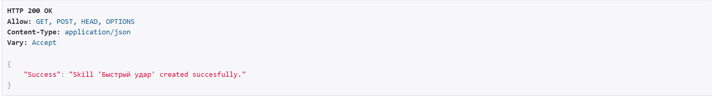
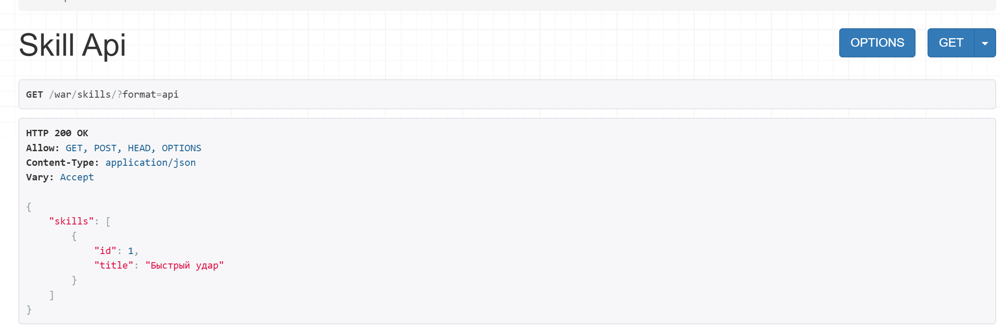
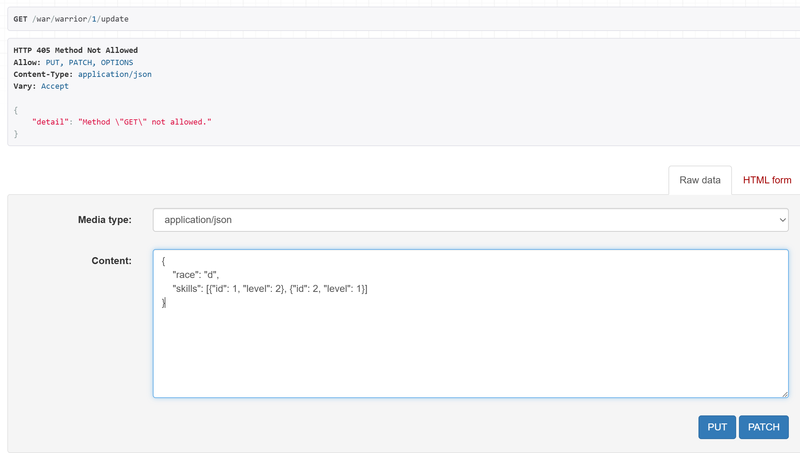
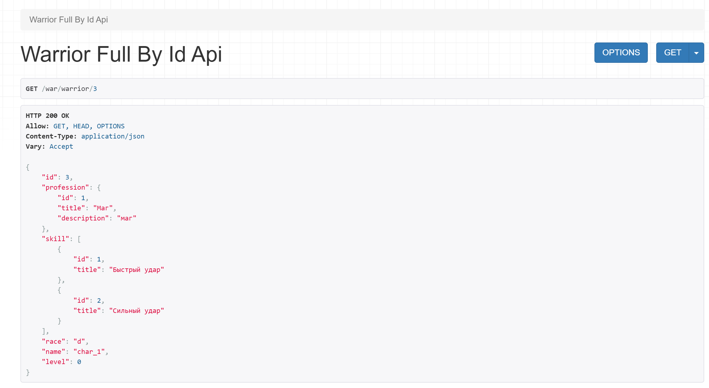

# Практическое задание 1
## Задание
Реализовать ендпоинты для добавления и просмотра скилов методом, описанным в пункте выше.
## Выполнение




# Практическое задание 2
## Задание
Практическое задание:
Реализовать ендпоинты:
Вывод полной информации о всех войнах и их профессиях (в одном запросе).
Вывод полной информации о всех войнах и их скилах (в одном запросе).
Вывод полной информации о войне (по id), его профессиях и скилах.
Удаление война по id.
Редактирование информации о войне.
## Выполнение






# Листинг
## Сериализаторы
```python
from rest_framework import serializers
from .models import *


class SkillSerializer(serializers.ModelSerializer):
    class Meta:
        model = Skill
        fields = "__all__"


class ProfessionSerializer(serializers.ModelSerializer):
    class Meta:
        model = Profession
        fields = "__all__"

class WarriorCreateSerializer(serializers.ModelSerializer):
    profession = serializers.PrimaryKeyRelatedField(queryset=Profession.objects.all(), required=False, allow_null=True)
    class Meta:
        model = Warrior
        fields = ['race', 'name', 'level', 'profession']

class WarriorsWithProfessionSerializer(serializers.ModelSerializer):
    profession = ProfessionSerializer()

    class Meta:
        model = Warrior
        fields = "__all__"

class WarriorsWithSkillsSerializer(serializers.ModelSerializer):
    skill = SkillSerializer(many=True)

    class Meta:
        model = Warrior
        fields = "__all__"

class WarriorFullSerializer(serializers.ModelSerializer):
    profession = ProfessionSerializer()
    skill = SkillSerializer(many=True)

    class Meta:
        model = Warrior
        fields = "__all__"

class SkillOfWarriorSerializer(serializers.Serializer):
    id = serializers.IntegerField()
    level = serializers.IntegerField(min_value=1)

class WarriorUpdateSerializer(serializers.ModelSerializer):
    profession = serializers.PrimaryKeyRelatedField(queryset=Profession.objects.all(), required=False, allow_null=True)
    skills = SkillOfWarriorSerializer(many=True, required=False)

    class Meta:
        model = Warrior
        fields = ['name', 'race', 'level', 'profession', 'skills']
    
    def update(self, instance, validated_data):
        instance.name = validated_data.get('name', instance.name)
        instance.race = validated_data.get('race', instance.race)
        instance.level = validated_data.get('level', instance.level)
        instance.profession = validated_data.get('profession', instance.profession)
        instance.save()

        skills_data = validated_data.get('skills')
        if skills_data is not None:
            SkillOfWarrior.objects.filter(warrior=instance).delete()
            for skill_item in skills_data:
                skill_id = skill_item['id']
                skill_level = skill_item['level']
                if not Skill.objects.filter(id=skill_id).exists():
                    raise serializers.ValidationError(f"Skill с id={skill_id} не существует.")
                SkillOfWarrior.objects.create(
                    warrior=instance,
                    skill_id=skill_id,
                    level=skill_level
                )
        return instance
```
## Представления
``` python 
from rest_framework.views import APIView
from rest_framework import generics
from rest_framework.response import Response
from .models import Skill, Warrior
from .serializers import *

class SkillAPIView(APIView):
    def get(self, request):
        skills = Skill.objects.all()
        serializer = SkillSerializer(skills, many=True)
        return Response({"skills": serializer.data})
    
    def post(self, request):
       skill = request.data.get("skill")
       serializer = SkillSerializer(data=skill)

       if serializer.is_valid(raise_exception=True):
           skill_saved = serializer.save()

       return Response({"Success": "Skill '{}' created succesfully.".format(skill_saved.title)})

class WarriorWithProffesionAPIView(generics.ListAPIView):
    queryset = Warrior.objects.all()
    serializer_class = WarriorsWithProfessionSerializer

class WarriorWithSkillsAPIView(generics.ListAPIView):
    queryset = Warrior.objects.all()
    serializer_class = WarriorsWithSkillsSerializer

class WarriorFullByIdAPIView(generics.RetrieveAPIView):
    queryset = Warrior.objects.all()
    serializer_class = WarriorFullSerializer

class WarriorUpdateAPIView(generics.UpdateAPIView):
    queryset = Warrior.objects.all()
    serializer_class = WarriorUpdateSerializer

class WarriorDeleteAPIView(generics.DestroyAPIView):
    queryset = Warrior.objects.all()

class WarriorCreateAPIView(generics.CreateAPIView):
    queryset = Warrior.objects.all()
    serializer_class = WarriorCreateSerializer

class ProfessionCreateAPIView(generics.CreateAPIView):
    queryset = Profession.objects.all()
    serializer_class = ProfessionSerializer
```